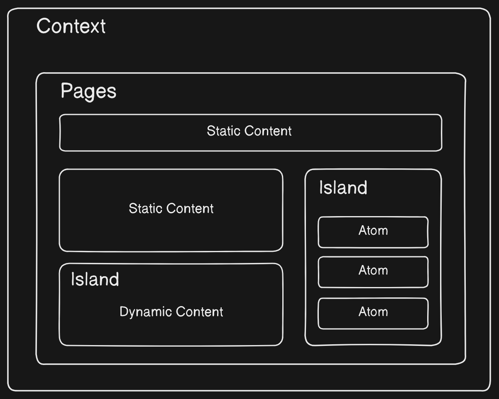

# Classy JS

A very small framework frontend based on OOP and Atomic design.



The main idea is to use javascript only when necessary, that's why the island concept.

## Getting Started

A minimal app

```js
import { mountIsland, Container } from "@slydragonn/classyjs"

const myApp = new Container({
  children: {
    text: "Hello World!",
  },
});

mountIsland(document.getElementById("island"), myApp)
```

## Install

```bash
npm i @slydragonn/classyjs
```

A sample app built with vitejs:

```bash
npx create-classyjs-app@slydragonn/classyjs project-name
```

## API

Mount Application:

```js
mountIsland(root, atom)
```

Remove Atom:

```js
import { Span } from "@slydragonn/classyjs"

const hello = new Span({
  children: "Hello World!"
})

hello.remove()
```

### Atoms:

- Container
- Title
- Text
- Span
- Button
- ListItem
- Option
- Image
- Link
- Input


Initial State, Life Cycle and State Update for Container, Link, ListItem:

```js
import { mountIsland, Container } from "@slydragonn/classyjs";

/*
the classes of Container, Link and ListItem can had many children
1: Initial State
2: Life Cycle to listen the mount and unmount

1. Initial State:
    * props: properties of a HTML Element like style.
    * children: object with many children like atoms, numbers or text.
    * events: events of a HTML Element like click, change.
    * attrs: Attributes of the HTML Element like class, id.
2. Life Cycle:
    * mount: a function that runs when an element is mounted
    * unmount: a function that runs when an element is unmounted
*/

const example = new Container(
  {
    props: {},
    children: {
      text: "Hello World!",
    },
    events: {
      click: () => console.log("Hello"),
    },
    attrs: {
      class: "container",
    },
  },
  {
    mount: () => console.log("Atom did mount"),
    unmount: () => console.log("Atom did unmount"),
  },
);

/*
Update the State: All initial state can be updated 
using the update method. You can also listen to the 
update with the second parameter that accepts a callback
*/
example.update(
  {
    children: {
      text: "new Children",
    },
  },
  (state) => console.log(state),
);
```

Children for Title, Text, Span, Button and Option:

```js
import { Span } from "@slydragonn/classyjs"

// the atoms Title, Text, Span, Button and Option only accepts one child
const text = new Span({
  children: "I am a span"
})
```

Image and Input don't accept children.

### Molecules:

- List
- Select
  Accept an Array as children:

```js
import { List, ListItem } from "@slydragonn/classyjs"

const numbers = [1, 2, 3, 4, 5]

const myList = new ListItem({
  children: numbers.map(number => {
    return new ListItem({
      children: {
        value: number
      }
    })
  })
})
```

### Context

Create a global state store in the browser session storage.

```js
import { createContext } from "@slydragonn/classyjs";

/*
Accept two params:
  1. context name
  2. initial State
And return two values:
  1. initial State
  2. setState function: accept a callback that receives state as a parameter

*/
const { initialState, setState } = createContext("counter", 0);

setState((state) => state + 1);
```
